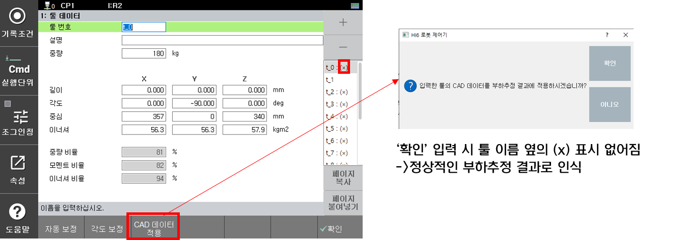

# 1.2 주의 사항 및 안내

- 부하추정시 추정하는 부하는 툴좌표계 기준입니다.

- 부하추정 기능은 로봇의 원활한 동작을 위한 것입니다. 이 기능을 중량 등의 정밀한 계측을 위해 사용하는 것은 적합하지 않습니다. 

- 로봇이 지면에 설치된 경우에만 부하추정 기능을 사용할 수 있습니다. 즉, 벽면, 천장에 설치된 로봇의 경우 부하추정 기능을 지원하지 않습니다.

- 툴의 물성치(질량, 무게중심, 이너셔)가 작을수록 추정 오차가 증가합니다. 툴의 물성치가 작을 경우에는 사용자가 툴데이터를 수동 입력하시기 바랍니다.

- 로봇에 장착되는 툴 및 툴이 핸들링하는 작업물들이 있는 경우, 각각의 조건에 대해 툴데이터를 등록하여 사용해야 합니다. (툴) 및 (툴+작업물) 조건에서 부하추정을 각각 수행하시기 바랍니다.
  

가반하중 50kg 미만의 로봇은 부하추정 기능을 지원하지 않습니다.


- 부하추정 기능은 충분한 워밍업 후 1시간 이상 제어기를 off 한 후 측정하는 것이 가장 정확합니다. 모터의 온도가 증가할수록 부하추정 오차가 증가할 수 있습니다. 


추천하는 온도 범위는 35~40도입니다. 엔코더 온도는 시스템 특성데이터 또는 부하추정 수집파일에서 확인 가능합니다.


- 무게 등의 정확한  툴정보(ex. 설계치, 측정치)를 가지고 있다면 툴 데이터에 수동으로 입력하시는 것이 더 정확합니다. ('CAD데이터 적용' 수행 필요)

- 특정 호기에서 튜닝된 값이 모든 호기에서 동일한  추정 성능을 보장하지는 않습니다. 호기별 기계적, 운전 상태별 특성이 다릅니다. (기계오차, 모터 특성 편차, 윤활상태, 온도 조건 등)
