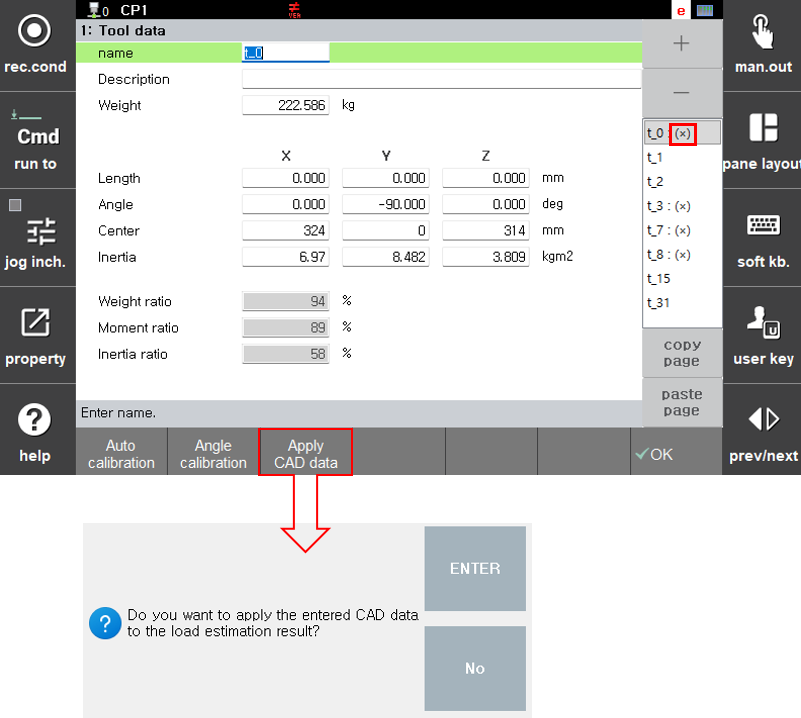

# 1.2 注意事项和说明

- 负载估计是在工具坐标系统基础上进行的。

- 负载估计功能旨在支持稳定和最佳的机器人操作。它不适用于精确测量负载重量或其他物理值。

- 负载估计功能仅在机器人安装在地面上时可用。安装在墙壁或天花板上的机器人不支持此功能。

- 工具的物理属性（重量、重心和惯性）越小，估计误差可能越大。如果工具的物理值非常小，建议用户手动输入工具数据。

- 如果机器人使用多个条件，例如单独工具或工具与工件结合，必须为每种情况注册单独的工具数据。分别对每种条件执行负载估计：（仅工具）和（工具 + 工件）。


负载能力小于50公斤的机器人不支持负载估计功能。


- 为获得最准确的结果，建议在充分预热并在关闭控制器至少一小时后进行负载估计。随着电机温度的增加，估计精度可能会降低。


推荐的温度范围是35-40°C。编码器温度可以通过系统特性数据或负载估计日志文件检查。


- 如果有准确的工具数据，如设计值或测量值（例如，重量、重心），手动将这些值输入工具数据设置可以提供更高的准确性。（需要执行“应用CAD数据”）。

- 在一种机器人模型上调校的值不一定能保证在同一型号的其他设备上获得相同的估计性能。机械和操作特性因机器人而异，包括机械公差、电机性能偏差、润滑条件和温度环境。