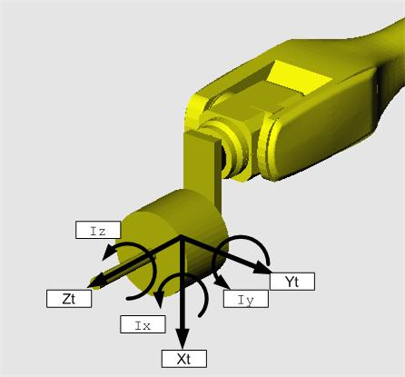

# 1. 개요

부하추정 기능이란 로봇 끝단에 취부되어 있는 부하의 중량과 무게중심위치를 구하는 기능입니다. 로봇을 동력학 모델 기반으로 제어하기 위해서는 로봇 본체의 동력학 파라미터와 로봇 부하에 대한 동력학 파라미터가 함께 필요합니다. 이 때, 로봇에 취부되는 부하는 현장에 따라 여러 가지가 될 수 있고, 그 데이터를 현장에서 계산하여 얻기 어렵기 때문에 로봇 제어기에서 자동으로 추정하는 기능이 필요합니다.

**※ 부하추정 좌표계 : 툴좌표계**


* 부하추정 기능은 로봇의 원활한 동작을 위한 것입니다. 이 기능을 중량 등의\
  정밀한 계측을 위해 사용하는 것은 적합하지 않습니다.
* 로봇이 지면에 설치된 경우에만 부하추정 기능을 사용할 수 있습니다.\
  즉, 벽면, 천장에 설치된 로봇의 경우 부하추정 기능을 지원하지 않습니다.
* 툴의 물성치(질량, 무게중심, 이너셔)가 작을수록 추정 오차가 증가합니다.\
  툴의 물성치가 작을 경우에는 사용자가 툴데이터를 수동 입력하시기 바랍니다.
* 로봇에 장착되는 툴 및 툴이 핸들링하는 작업물들이 있는 경우, 각각의 조건에\
  대해 툴데이터를 등록하여 사용해야 합니다. (툴) 및 (툴+작업물) 조건에서\
  부하추정을 각각 수행하시기 바랍니다.
* 부하추정 기능은 충분한 워밍업 à 1시간 이상 제어기를 off 한 후 측정하는 것이 가장 정확합니다. 모터의 온도가 증가할수록 부하추정 오차가 증가할 수 있습니다.

