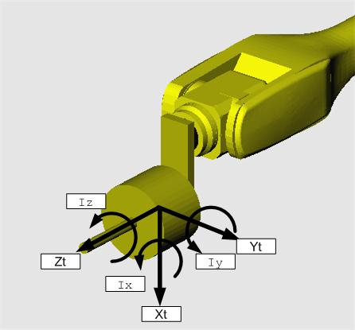

# Hi6 로봇제어기 기능설명서 - 부하 추정


본 제품 설명서에서 제공되는 정보는 현대로보틱스의 자산입니다.

현대로보틱스의 서면에 의한 동의 없이 전부 또는 일부를 무단 전재 및 재배포할 수 없으며, 제3자에게 제공되거나 다른 목적에 사용할 수 없습니다.

본 설명서는 사전 예고 없이 변경될 수 있습니다.

**Copyright ⓒ 2020 by Hyundai Robotics**

# 1. 개요

부하추정 기능이란 로봇 끝단에 취부되어 있는 부하의 중량과 무게중심위치를 구하는 기능입니다. 로봇을 동력학 모델 기반으로 제어하기 위해서는 로봇 본체의 동력학 파라미터와 로봇 부하에 대한 동력학 파라미터가 함께 필요합니다. 이 때, 로봇에 취부되는 부하는 현장에 따라 여러 가지가 될 수 있고, 그 데이터를 현장에서 계산하여 얻기 어렵기 때문에 로봇 제어기에서 자동으로 추정하는 기능이 필요합니다.

**※ 부하추정 좌표계 : 툴좌표계**


* 부하추정 기능은 로봇의 원활한 동작을 위한 것입니다. 이 기능을 중량 등의\
  정밀한 계측을 위해 사용하는 것은 적합하지 않습니다.
* 로봇이 지면에 설치된 경우에만 부하추정 기능을 사용할 수 있습니다.\
  즉, 벽면, 천장에 설치된 로봇의 경우 부하추정 기능을 지원하지 않습니다.
* 툴의 물성치(질량, 무게중심, 이너셔)가 작을수록 추정 오차가 증가합니다.\
  툴의 물성치가 작을 경우에는 사용자가 툴데이터를 수동 입력하시기 바랍니다.
* 로봇에 장착되는 툴 및 툴이 핸들링하는 작업물들이 있는 경우, 각각의 조건에\
  대해 툴데이터를 등록하여 사용해야 합니다. (툴) 및 (툴+작업물) 조건에서\
  부하추정을 각각 수행하시기 바랍니다.
* 부하추정 기능은 충분한 워밍업 à 1시간 이상 제어기를 off 한 후 측정하는 것이 가장 정확합니다. 모터의 온도가 증가할수록 부하추정 오차가 증가할 수 있습니다.

# 2. 부하추정 결과

# 2.1 중량

로봇 끝단에 취부되는 부하의 총 중량입니다. 단위는 kg입니다.
# 2.3 이너셔 (관성)

부하의 자체 관성모멘트입니다. x, y, z 3개 축을 중심으로 회전한다고 할 때 부하에 분포되어 있는 각 질량과 회전축으로부터의 거리의 제곱을 곱한 합을 말합니다. 이너셔는 축 둘레의 질량 분포에 따라 정해지며, 부하의 질량이 회전축으로부터 떨어져 분포하고 있을수록 큰 값을 갖습니다. x, y, z 축에 대해 Kgm2의 단위를 사용합니다.

# 3. 부하추정 메뉴 설명

『**설정**』 → 『**6.자동 캘리브레이션**』 → 『**4.부하추정 기능**』에서 부하추정을 실행합니다.


『**4.부하추정 기능**』 메뉴를 선택할 때, 제어 모드가 ‘**제진제어**’이면 ‘**PPI**’ 모드로 변경하기 위해 자동으로 모터가 ‘**Off**’ 됩니다. 부하추정 종료시 다시 ‘**제진제어**’모드로 변경되며 모터 ‘**Off**’됩니다.


# 3.1 툴번호

사용될 툴을 대표하는 번호를 선언합니다. 선언된 번호를 티칭프로그램의 툴번호에 적용하면 추정된 부하의 물성치에 따라 로봇이 동작하게 됩니다. 툴번호는 정의된 툴정보에 대해서 사용 가능합니다.
# 3.2 동작 영역

부하추정 모션을 위한 각 축 동작영역을 나타냅니다. 『**축각도**』는 로봇의 현재 각 축 정보를 나타내며, 『**시작자세**』는 부하추정이 시작되는 초기 자세 정보를 알려줍니다. 『**동작영역**』의 『**min**』과 『**max**』는 부하추정을 수행하는 모션이 사용하는 각 축의 최소, 최대값을 나타냅니다. B축과 R1축의 경우는 최소, 최대 동작영역을 설정할 수 있습니다. 기본 동작영역 조건은 아래와 같습니다.

\[**기본 동작영역**]

&#x20;  B축   동작영역 (min) : (60도 - H축 각도 – V축 각도)

&#x20;  B축   동작영역 (max) : (120도 – H축 각도 – V축 각도)

&#x20;  R1축  동작영역 (min) : 0도

&#x20;  R1축  동작영역 (max) : 90도

특정 손목축 동작영역 설정조건에서는 추정이 불가능한 물성치가 존재할 수 있습니다. 이러한 경우, 사용자가 직접 물성치를 입력해야 합니다.

모든 물성치를 추정하기 위한 B축과 R1축 동작영역 조건은 아래와 같습니다.

\[**모든 물성치 추정을 위한 동작영역 조건**]

&#x20;  \- B축 동작영역 : (40-H-V)이상 \~ (140-H-V)이내

&#x20;  \- B축 min\~max 사이 각도 20도 이상

&#x20;  \- R1축 min\~max 사이 각도 60도 이상
# 3.3 확인운전

‘**확인운전**’은 ‘정상운전’보다 느린 속도(약 50\~200 mm/s)로 동작하여 간섭여부를 확인하기 위한 기능입니다. 확인 운전을 실행하면 추정은 이루어지지 않습니다.

부하추정은 일정패턴으로 로봇을 움직인 후 부하의 정보를 얻는 것이기 때문에, 로봇 동작 시 주변환경 혹은 로봇자신과의 간섭에 주의해야 합니다. 따라서, ‘**정상운전**’ 실행 전에 ‘**확인운전**’으로 간섭 여부를 확인하고 충돌 위험시 『**비상정지**』 버튼을 누르거나, 『**Enable Switch**』를 ‘**Off**’하여 로봇을 정지시켜야 합니다. 확인 운전 동작이 완료되기 이전에 동작이 중단된 경우에는, 부하추정 메뉴를 다시 실행해야 합니다.

\[**실행 조건**]

&#x20;  로봇 제어기 : 수동 모드

&#x20;  Enable Switch : On
# 3.4 정상운전

부하추정을 실행하는 메뉴입니다. 빠른 속도로 진행되기 때문에 ‘**확인운전**’에서 간섭 여부를 확인한 후 실행해야 합니다.

\[**실행 조건**]

&#x20;  로봇 제어기 : 수동 모드

&#x20;  Enable Switch : On
# 3.5 축별 부가질량

축별 부가질량 메뉴로 이동합니다. 정확한 부하추정을 수행하기 위해서는 3축의 부가중량 정보(질량, x축 무게중심, z축 무게중심)를 입력해야 합니다. 부가질량은 프레임에 설치된 플레이트, 신호박스, 케이블 등을 포함합니다.

3축 부가질량의 입력 좌표계는 다음과 같습니다.

# 3.6 자세지정

추정 모션의 시작자세를 지정합니다. 사용자는 로봇의 기본축을 이동시켜 로봇이나 툴에 간섭이 발생하지 않을만한 위치를 정한 후 『**주축 자세지정**』을 눌러서 시작 자세를 지정합니다.

S축은 자세 지정에 제한이 없지만 H축과 V축은 로봇 V축 프레임의 각도가 지면기준 ±60 deg 이내가 되도록 설정해야 하며, 좋은 추정을 위해 가능한 지면기준 0 deg에 가깝게 설정하는 것을 추천합니다. ±60 deg를 초과하는 범위에서 『**자세지정**』키를 누르면 『**지면기준 V축의 각도가 60도 이내야 합니다**』라는 메시지가 표시됩니다.

1.  **현재 축각도**

    현재 로봇이 취하고 있는 주(S, H, V)축의 자세를 각도로 표시됩니다.
2.  **시작 자세**

    부하추정을 위해 지정된 로봇 주(S, H, V)축의 자세가 각도로 표시됩니다. ‘**확인운전**’ 또는 ‘**정상운전**’ 버튼을 실행하면 로봇 자세가 지정값의 자세로 변경됩니다.
# 4. 부하추정 동작 영역

부하추정의 모션은 6축 로봇(HX165, HS165, HS200, HA006, HA020 등), 4축 팔레타이징 로봇(HP160), 도장로봇(YP020)에 따라 상이하고 그에 따른 동작 영역은 다음과 같습니다.
# 4.1 6축 로봇

# 4.2 4축 팔레타이징 로봇

# 4.3 도장 로봇

# 5. 부하추정 결과 적용방법

# 5.1 부하추정 결과 적용

부하추정 결과 확인 창에서 ‘**OK**’버튼을 누른 후 질의 창 “**부하추정 결과값으로 반영할까요?**” 에서 제어기 적용에 동의(“**Enter**”)한 경우, 추정된 부하의 정보가 지정된 툴번호에 저장됩니다. 반대로 “**No**”키를 눌렀을 경우는 저장되지 않습니다.

이렇게 저장된 툴 데이터는 티칭프로그램 상의 툴데이터 선택을 통해 로봇 동작 및 기능 수행 시 적용됩니다. 따라서 툴의 변경 및 툴이 작업물을 핸들링 할 경우, 이 상태를 나타내는 툴데이터 정보를 티칭프로그램의 툴데이터로 사용해야 합니다.
# 5.2 부하추정 결과 확인 및 수정

추정된 부하의 정보는 『**설정**』 → 『**3.로봇파라미터**』 → 『**1.툴데이터**』 메뉴에서 확인 및 수정할 수 있습니다. 추정할 때 입력한 툴번호에서 추정된 결과가 나타납니다.


이너셔의 경우, 추정 결과는 부하의 질량 중심에 대한 이너셔입니다.\
특정방향에 대한 이너셔가 작은 경우에는, 추정결과가 0으로 표시될 수 있습니다.

# 별첨

